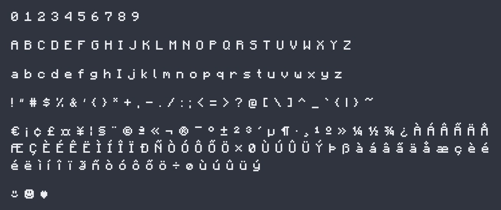

# Minecraft Font

Let's face it, the font used in Minecraft is superior to anything that exists on your paltry computer. The elegant pixels, the unique spacing, and the almost unreadable punctuation all add to its pixelated charm. Why not add that font to your computer or phone and enjoy that Minecraft-y goodness wherever you are?

This project is an attempt to distill those beautiful pixels into a font capable of running on your local device in any application that supports custom fonts. The font has been carefully recreated pixel-by-pixel, with great care given to the spacing and strokes to ensure that the font looks good in any application.

*Notice: This project is not affiliated with Minecraft or Mojang in any way and is exclusively a fan project. The assets used in this project are solely owned by Mojang/Microsoft. As such, the license for this project does not apply to assets in this repository owned by the aforementioned companies.*

## About this font

This is an OpenType font containing 195 glyphs carefully designed to look exactly like the characters in Minecraft. The font contains all the visible UTF-8 characters between U+0000 to U+00FF, which includes most Latin glyphs you'd use on a daily basis. I've also added a few extra glyphs like `☺` which are commonly used in the game.

What makes this different from other attempts at emulating the Minecraft bitmap font is that it takes into careful consideration how converting from a bitmap font to an OpenType font can affect metrics such as kerning, intended weight, and line height. Through a lot of experimenting, I've selected bounding metrics that best match the original look when rendered as a modern font.

Regular Weight             |  **Bold Weight**
:-------------------------:|:-------------------------:
|  |  |

I've also added a bold version of each character that was designed with the same algorithm that Minecraft uses for bolding glyphs. Instead of just increasing the stroke weight like with a normal font, each character becomes thicker by shifting the pixels one pixel to the right and printing them overtop the original design. The end result is completely game-accurate and only mostly unreadable!

## How to install

### Windows

Download the most recent `Minecraft.otf` and `Minecraft-Bold.otf` files from the [Releases](https://github.com/IdreesInc/Minecraft-Font/releases) page. Right click on the downloaded font files and select **Install**. You might need administrative access to install fonts, depending on your machine.

### Mac

Download the most recent `Minecraft.otf` and `Minecraft-Bold.otf` files from the [Releases](https://github.com/IdreesInc/Minecraft-Font/releases) page. Double click on the downloaded font files and select **Install Font** in the window that appears. More help available [here](https://support.apple.com/en-us/HT201749).

## How to use

After following the installation instructions up above, simply select the "Minecraft" font in any application that supports custom fonts. You might need to restart the application or your computer for the font to appear.

## FAQ

### How were these characters generated?

Each character was first drafted by hand using [bitfontmaker2](https://www.pentacom.jp/pentacom/bitfontmaker2/). The set was then exported using their built in bitmap to TTF converter, and from there the resultant .ttf files were opened in [FontForge](https://fontforge.org/en-US/) and cleaned up.

### Why doesn't this font contain more characters?

Each of these glyphs had to be copied over by hand as well as their bold equivalents, which takes time. The font contains most of the common latin characters you might use, with a goal of containing all of the visible UTF-8 characters between U+0000 to U+00FF. If you have a specific glyph that you would like added to the font, you are free to create an issue, though I make no promises that I will have the time to add it. In the future, someone smarter than me might make a script to directly convert the bitmap fonts stored as sprite sheets in Minecraft into modern vector fonts.

<!-- ### Is there a monospaced version?

Absolutely, check out [Minecraft Mono](https://github.com/IdreesInc/Minecraft-Mono) for a monospaced version with updated glyphs for better readability. -->
